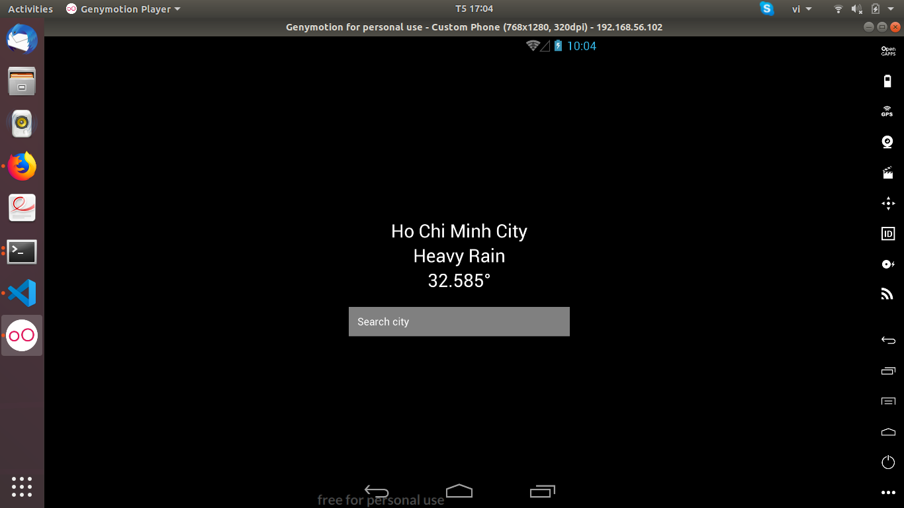

# Props and State testing app
I wrote this app by React Native to check knowlegde about props and state, how to transfer data to component.

When you input any text and submit it by hitting Enter or Return button (virtual keyboard) the result above the TextInput will change.

At this point, this app is very simple but maybe I will improve it in the future by adding more animation and images.
:smile:

**Updated**

I just added networking part into this app. I get data from MetaWeather API so when you input the right city name, it will output name, weather, and temperature in this city. Otherwise it will annouce that "Could not load weather information".

